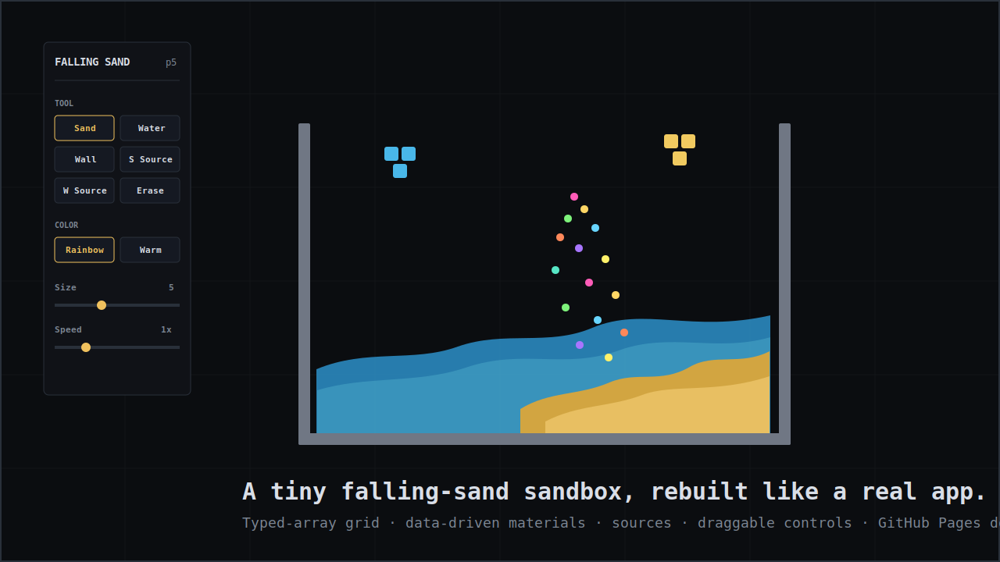

# Falling Sand

A tiny falling-sand sandbox built with p5.js, then refactored into a small modular frontend project.

[Try it on GitHub Pages](https://huiishan99.github.io/web-falling-sand/)



## What You Can Do

- Paint sand, water, walls, erasers, and source blocks.
- Drop sand into water and watch denser particles sink.
- Build containers, fountains, sand streams, and little material experiments.
- Drag the control panel out of the way while drawing.
- Pause, step the simulation frame by frame, clear the world, or save a PNG.

## Why This Version Is More Interesting

This started as a single-file p5 sketch. It is now structured more like a real app:

- Data-driven tools and materials.
- Typed-array grid storage for better performance.
- A separate simulation engine for material rules.
- A renderer with an offscreen p5 buffer.
- Generated UI controls instead of hand-maintained button markup.
- ESLint, Prettier, tests, Vite, and GitHub Pages deployment.

## Project Structure

```text
.
├─ index.html
├─ style.css
├─ public/
│  └─ p5.js
├─ src/
│  ├─ main.js          # p5 lifecycle and app wiring
│  ├─ constants.js     # shared constants and default state
│  ├─ materials.js     # data-driven material/tool definitions
│  ├─ grid.js          # typed-array grid storage
│  ├─ simulation.js    # sand, water, wall, and source behavior
│  ├─ renderer.js      # drawing and brush preview
│  ├─ input.js         # pointer painting
│  └─ ui.js            # toolbar controls and dragging
├─ test/
│  └─ grid.test.js
└─ .github/workflows/pages.yml
```

## Controls

| Key     | Tool           |
| ------- | -------------- |
| `1`     | Sand           |
| `2`     | Water          |
| `3`     | Wall           |
| `4`     | Sand Source    |
| `5`     | Water Source   |
| `6`     | Erase          |
| `Space` | Pause / Resume |
| `C`     | Clear          |

## Development

```bash
npm install
npm run dev
```

Useful checks:

```bash
npm test
npm run lint
npm run build
```

## Deployment

The repo includes a GitHub Pages workflow at `.github/workflows/pages.yml`.

On push to `main`, it installs dependencies, runs tests, builds with Vite, and publishes `dist/` to GitHub Pages.

`p5.js` is kept in `public/p5.js` so Vite copies it into the production build.
