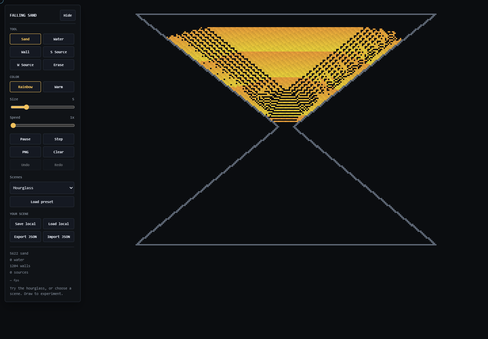

# Falling Sand

A tiny falling-sand sandbox built with p5.js, then refactored into a small modular frontend project.

[Try it on GitHub Pages](https://huiishan99.github.io/web-falling-sand/)



## What You Can Do

- Paint sand, water, walls, erasers, and source blocks.
- Drop sand into water and watch denser particles sink.
- Build containers, fountains, sand streams, and little material experiments.
- Drag the control panel out of the way while drawing.
- Pause, step the simulation frame by frame, clear the world, or save a PNG.
- Draw continuous strokes with a mouse, pen, or touch; thin diagonal walls are sealed.
- Undo and redo whole strokes, clears, preset changes, and scene loads.
- Save a scene locally, or export/import a portable JSON file.
- Start with an hourglass, water dam, or cascading fountain.
- Collapse the mobile toolbar while keeping pause and undo within reach.

## Why This Version Is More Interesting

This started as a single-file p5 sketch. It is now structured more like a real app:

- Data-driven tools and materials.
- Reused typed-array simulation buffers and occupied-area traversal.
- A separate simulation engine for material rules.
- A grid-resolution pixel buffer, cached colors, and cached paused frames.
- Statistics refresh at 4 Hz, with an FPS indicator.
- Generated UI controls instead of hand-maintained button markup.
- ESLint, Prettier, tests, Vite, and GitHub Pages deployment.

## Project Structure

```text
.
├─ index.html
├─ style.css
├─ public/
│  └─ p5.js
├─ src/
│  ├─ main.js          # p5 lifecycle and app wiring
│  ├─ constants.js     # shared constants and default state
│  ├─ materials.js     # data-driven material/tool definitions
│  ├─ grid.js          # typed-array grid storage
│  ├─ simulation.js    # sand, water, wall, and source behavior
│  ├─ renderer.js      # drawing and brush preview
│  ├─ input.js         # pointer painting
│  ├─ brush.js         # brush materials and colors
│  ├─ scene.js         # validated saves and bounded undo history
│  ├─ presets.js       # responsive experiment scenes
│  └─ ui.js            # toolbar controls and dragging
├─ test/
│  ├─ grid.test.js
│  ├─ simulation.test.js
│  └─ workspace.test.js
├─ scripts/benchmark.mjs
├─ vite.config.js     # relative asset paths for subdirectory hosting
└─ .github/workflows/pages.yml
```

## Controls

| Key                           | Tool           |
| ----------------------------- | -------------- |
| `1`                           | Sand           |
| `2`                           | Water          |
| `3`                           | Wall           |
| `4`                           | Sand Source    |
| `5`                           | Water Source   |
| `6`                           | Erase          |
| `Space`                       | Pause / Resume |
| `C`                           | Clear          |
| `Ctrl/Cmd+Z`                  | Undo           |
| `Ctrl/Cmd+Shift+Z` / `Ctrl+Y` | Redo           |

Drawing temporarily holds the simulation so each stroke is one coherent edit.
Undo, redo, clear, and scene loading pause the world; press Resume to continue.
History holds up to 20 snapshots within a 32 MB cell-data budget. New edits discard redo.

## Scenes and Mobile Use

The hourglass starts on launch. Choose a scene and click **Load preset** to replace
the canvas; Undo brings back the previous experiment. Erase the dam wall to release
water, or redirect the fountain with new walls.

**Save local** replaces one save slot in this browser and origin. Reloading the page
starts the hourglass; **Load local** explicitly restores your saved scene. Clearing
browser storage deletes that slot, so use **Export JSON** for a portable backup.
**Import JSON** validates the file before changing the world. Version 1 accepts up
to 1,000,000 cells and a 12 MB file. Saves contain dimensions, materials, and colors;
toolbar settings and undo history are not included. PNG exports are pictures only.

Loaded scenes preserve cell positions in the current viewport. Cells outside a
smaller viewport are cropped with an on-screen notice; the saved file is unchanged.
Resize before loading if you want more of a large scene to fit.

On phones, the toolbar starts collapsed. Tap **Tools** to open a scrollable panel,
then **Hide** to return to the canvas. Touch buttons are at least 44 px tall.

## Development

```bash
npm install
npm run dev
```

Useful checks:

```bash
npm test
npm run lint
npm run build
npm run benchmark
```

Simulation tests cover sand/water conservation, sinking through stationary water,
occupied flow destinations, and source emission. Seeded mixed worlds also check
material counts, sand colors, and wall positions across 100 steps per seed.
Workspace tests cover continuous strokes, scene validation, history isolation and
limits, presets, and simulation buffer reuse. See [the devlog](docs/DEVLOG.md) for
local browser verification, benchmark conditions, and limitations.

## Deployment

The repo includes a GitHub Pages workflow at `.github/workflows/pages.yml`.

On push to `main`, it installs dependencies, runs tests and lint, builds with Vite, and publishes `dist/` to GitHub Pages.

Vite uses relative asset paths so the build works under `/web-falling-sand/` as well as a domain root.

`p5.js` is kept in `public/p5.js` so Vite copies it into the production build.
